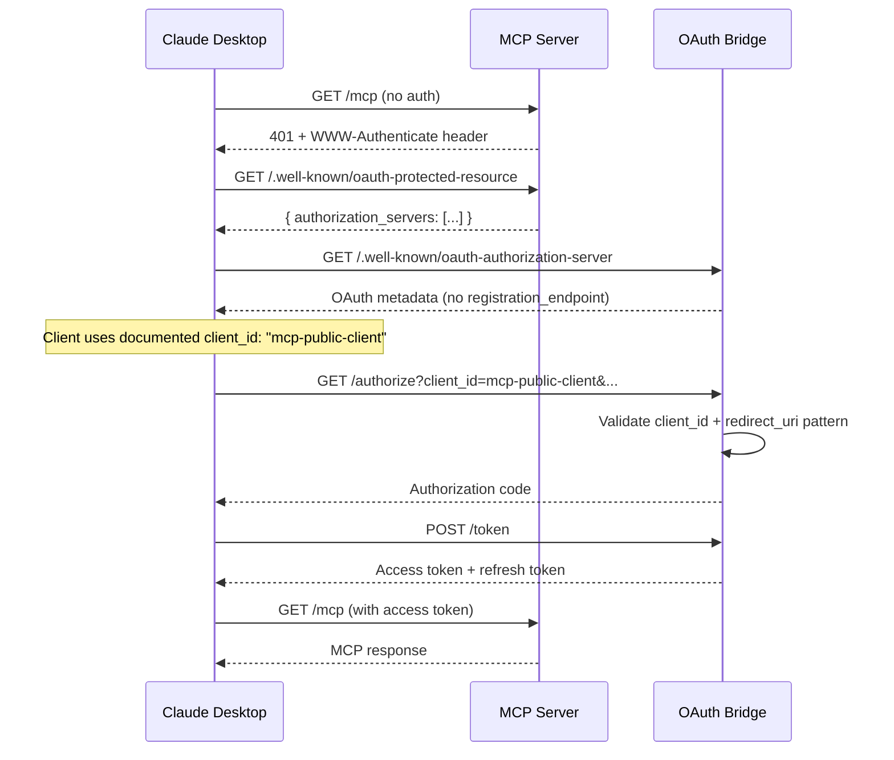

# Current Task: MCP OAuth Integration - Claude Desktop Callback Resolution

## Status: ✅ RESOLVED - Ready for Deployment

## Strategic Decision: Option B - Well-Known Client Configuration

After evaluating three implementation approaches (RFC 7591 Dynamic Client Registration, Well-Known Client Configuration, and Custom Discovery), we have chosen **Option B: Well-Known Client Configuration** as the optimal solution for IntelligenceBank's MCP OAuth integration.

### Why Option B?

**Context:**
- Trusted, first-party MCP clients (Claude Desktop, MCP Inspector)
- All clients have similar requirements
- Development and testing phase
- Need to eliminate manual `client_id` configuration friction

**Benefits:**
- ⚡ **Fast Implementation**: 2-4 hours vs 2-3 days for full DCR
- 🎯 **Simple Architecture**: Configuration in code, no database needed
- ✅ **Sufficient**: Meets all current requirements for trusted clients
- 🔄 **Upgradeable**: Can add RFC 7591 later if third-party integrations needed
- 📚 **Standards-Based**: Well-documented client_id is a recognized OAuth pattern

**Trade-offs (Acceptable):**
- Less granular per-client tracking (acceptable for trusted clients)
- Pattern-based redirect URI validation (secure with proper patterns)
- Shared client_id across MCP clients (standard for public clients)

## Problem Statement

When integrating the IB OAuth bridge with MCP servers, the `mcp_client_config` field is a non-standard extension that standard MCP clients (like Claude Desktop) do not recognize, requiring manual `client_id` configuration.

### Current Limitation
```json
{
  "mcpServers": {
    "ib-tools": {
      "url": "https://your-mcp-server.com/mcp",
      "mcp_client_config": {  // ❌ Non-standard, not recognized
        "client_id": "manually-configured-id"
      }
    }
  }
}
```

### Desired State (Zero Configuration)
```json
{
  "mcpServers": {
    "ib-tools": {
      "url": "https://your-mcp-server.com/mcp"  // ✅ That's it!
    }
  }
}
```

## Solution: Well-Known Client Configuration

Define a **documented, public client_id** that all MCP clients can use without registration. This eliminates manual configuration while maintaining OAuth 2.0 compliance.

### Architecture

```typescript
// Well-known public client for MCP
const MCP_PUBLIC_CLIENT = {
  client_id: 'mcp-public-client',
  client_type: 'public',
  allowed_redirect_patterns: [
    /^https:\/\/.*\.connectingib\.com\/callback$/,  // Production MCP servers
    /^https:\/\/mcp\.connectingib\.com\/callback$/, // Specific MCP endpoint
    /^http:\/\/localhost:\d+\/callback$/,           // Local development
  ],
  grant_types: ['authorization_code', 'refresh_token'],
  response_types: ['code'],
  requires_pkce: true,
  token_endpoint_auth_method: 'none',
};
```

### OAuth Discovery Flow



## Implementation Plan

### Phase 1: OAuth Metadata Endpoint ✅ COMPLETED

**Created:**
- [`src/handlers/well-known/oauth-authorization-server.ts`](../src/handlers/well-known/oauth-authorization-server.ts)
- CDK infrastructure for metadata endpoint

**Returns:**
```json
{
  "issuer": "https://{api-id}.execute-api.us-west-1.amazonaws.com/dev",
  "authorization_endpoint": "https://{api-id}.execute-api.us-west-1.amazonaws.com/dev/authorize",
  "token_endpoint": "https://{api-id}.execute-api.us-west-1.amazonaws.com/dev/token",
  "code_challenge_methods_supported": ["S256"],
  "grant_types_supported": ["authorization_code", "refresh_token"],
  "response_types_supported": ["code"],
  "token_endpoint_auth_methods_supported": ["none"],
  "scopes_supported": ["profile"]
}
```

Note: No `registration_endpoint` for Option B approach.

---

### Phase 2: Well-Known Client Configuration (Current)

#### Tasks

1. **Create client configuration module** 🆕 [`src/config/well-known-clients.ts`](../src/config/well-known-clients.ts)
   
   ```typescript
   export interface WellKnownClient {
     client_id: string;
     client_type: 'public' | 'confidential';
     allowed_redirect_patterns: RegExp[];
     grant_types: string[];
     response_types: string[];
     requires_pkce: boolean;
     token_endpoint_auth_method: string;
   }
   
   export const WELL_KNOWN_CLIENTS: Record<string, WellKnownClient> = {
     'mcp-public-client': {
       client_id: 'mcp-public-client',
       client_type: 'public',
       allowed_redirect_patterns: [
         /^https:\/\/.*\.connectingib\.com\/callback$/,
         /^https:\/\/mcp\.connectingib\.com\/callback$/,
         /^http:\/\/localhost:\d+\/callback$/,
       ],
       grant_types: ['authorization_code', 'refresh_token'],
       response_types: ['code'],
       requires_pkce: true,
       token_endpoint_auth_method: 'none',
     },
   };
   
   export function getWellKnownClient(clientId: string): WellKnownClient | null {
     return WELL_KNOWN_CLIENTS[clientId] || null;
   }
   
   export function validateRedirectUri(
     clientId: string,
     redirectUri: string
   ): boolean {
     const client = getWellKnownClient(clientId);
     if (!client) return false;
     
     return client.allowed_redirect_patterns.some(pattern => 
       pattern.test(redirectUri)
     );
   }
   ```

2. **Update authorize handler** ✏️ [`src/handlers/authorize/index.ts`](../src/handlers/authorize/index.ts)
   
   Changes:
   - Import well-known client configuration
   - Validate `client_id` against well-known clients
   - Use pattern matching for `redirect_uri` validation
   - Enforce PKCE for public clients
   
   ```typescript
   import { getWellKnownClient, validateRedirectUri } from '../../config/well-known-clients';
   
   // In authorize handler:
   const client = getWellKnownClient(client_id);
   if (!client) {
     return error('invalid_client', 'Unknown client_id');
   }
   
   if (!validateRedirectUri(client_id, redirect_uri)) {
     return error('invalid_redirect_uri', 'Redirect URI not allowed');
   }
   
   if (client.requires_pkce && !code_challenge) {
     return error('invalid_request', 'PKCE required for public clients');
   }
   ```

3. **Update token handler** ✏️ [`src/handlers/token/index.ts`](../src/handlers/token/index.ts)
   
   Changes:
   - Import well-known client configuration
   - Validate `client_id` against well-known clients
   - Support public clients (no client_secret)
   - Validate PKCE code_verifier
   
   ```typescript
   import { getWellKnownClient } from '../../config/well-known-clients';
   
   // In token handler:
   const client = getWellKnownClient(client_id);
   if (!client) {
     return error('invalid_client', 'Unknown client_id');
   }
   
   // Public clients don't require client_secret
   if (client.token_endpoint_auth_method === 'none') {
     // Validate PKCE instead
     if (!validatePKCE(code_verifier, storedChallenge)) {
       return error('invalid_grant', 'PKCE validation failed');
     }
   }
   ```

4. **Update metadata endpoint** ✏️ [`src/handlers/well-known/oauth-authorization-server.ts`](../src/handlers/well-known/oauth-authorization-server.ts)
   
   Remove `registration_endpoint` from response since we're not implementing DCR.

5. **Testing**
   - Test authorize flow with `mcp-public-client`
   - Test various redirect URI patterns
   - Verify PKCE enforcement
   - Test token exchange
   - Verify error handling

#### Files to Create/Modify
- 🆕 [`src/config/well-known-clients.ts`](../src/config/well-known-clients.ts)
- ✏️ [`src/handlers/authorize/index.ts`](../src/handlers/authorize/index.ts)
- ✏️ [`src/handlers/token/index.ts`](../src/handlers/token/index.ts)
- ✏️ [`src/handlers/well-known/oauth-authorization-server.ts`](../src/handlers/well-known/oauth-authorization-server.ts)

---

### Phase 3: Protected Resource Metadata (MCP Server Side)

Same as before - this is implemented on the MCP server, not the OAuth bridge.

**MCP Server Endpoint**: `GET /.well-known/oauth-protected-resource`

```json
{
  "resource": "https://your-mcp-server.com/mcp",
  "authorization_servers": [
    "https://66qz7xd2w8.execute-api.us-west-1.amazonaws.com/dev"
  ],
  "scopes_supported": ["profile"]
}
```

---

### Phase 4: Documentation & Integration Guide

#### Tasks

1. **Create MCP Integration Guide** 🆕 [`docs/mcp-integration.md`](./mcp-integration.md)
   
   **Content:**
   - Overview of zero-configuration approach
   - Well-known client_id: `mcp-public-client`
   - Allowed redirect URI patterns
   - Step-by-step integration instructions
   - Configuration examples for Claude Desktop
   - Troubleshooting guide

2. **Update API Documentation** ✏️ [`docs/api-documentation.md`](./api-documentation.md)
   
   **Add sections:**
   - Well-known client configuration
   - Public client authentication flow
   - Redirect URI pattern matching
   - Error codes specific to well-known clients

3. **Update Client Integration Guide** ✏️ [`docs/client-integration.md`](./client-integration.md)
   
   **Changes:**
   - Remove manual `client_id` configuration instructions
   - Add section on using well-known client_id
   - Update OAuth flow examples with `mcp-public-client`
   - Document allowed redirect URI patterns

4. **Update README** ✏️ [`README.md`](../README.md)
   
   **Add:**
   - MCP compliance section
   - Zero-configuration capability highlight
   - Link to MCP integration guide
   - Well-known client_id documentation

#### Example Documentation

**For MCP Server Developers:**

```markdown
# MCP Integration

## Quick Start

Your MCP clients can connect to IntelligenceBank OAuth without any manual configuration:

1. Use the well-known client ID: `mcp-public-client`
2. Ensure your callback endpoint matches one of these patterns:
   - `https://*.connectingib.com/callback`
   - `https://mcp.connectingib.com/callback`
   - `http://localhost:{port}/callback` (development)

3. Implement PKCE (S256 method) - required for public clients

That's it! No registration, no manual configuration needed.

## Example

```json
{
  "mcpServers": {
    "ib-tools": {
      "url": "https://mcp.connectingib.com/mcp"
    }
  }
}
```

The MCP client will automatically:
1. Discover the OAuth server via `/.well-known/oauth-protected-resource`
2. Use `mcp-public-client` as the client_id
3. Complete the OAuth flow with PKCE
```

---

### Phase 5: Testing & Validation

#### Tasks

1. **Unit Tests**
   - Test well-known client configuration lookup
   - Test redirect URI pattern matching
   - Test PKCE validation
   - Test error cases

2. **Integration Tests**
   - Test full OAuth flow with `mcp-public-client`
   - Test various redirect URI patterns
   - Test PKCE enforcement
   - Test token refresh

3. **End-to-End Tests**
   - Test with Claude Desktop (if available)
   - Test with MCP Inspector
   - Test discovery flow
   - Test error handling

4. **Security Tests**
   - Verify PKCE enforcement
   - Test redirect URI validation
   - Test invalid client_id rejection
   - Verify no bypass of pattern matching

#### Success Criteria
- ✅ MCP clients can connect without manual configuration
- ✅ OAuth flow completes successfully with well-known client
- ✅ Redirect URI patterns properly validated
- ✅ PKCE enforced for public clients
- ✅ All error cases handled gracefully
- ✅ Documentation complete and clear

---

## Technical Specifications

### Well-Known Client Configuration

```typescript
interface WellKnownClient {
  client_id: string;              // "mcp-public-client"
  client_type: 'public';          // No client_secret
  allowed_redirect_patterns: RegExp[]; // URI validation patterns
  grant_types: string[];          // ["authorization_code", "refresh_token"]
  response_types: string[];       // ["code"]
  requires_pkce: boolean;         // true
  token_endpoint_auth_method: string; // "none"
}
```

### Redirect URI Patterns

```typescript
const patterns = [
  /^https:\/\/.*\.connectingib\.com\/callback$/,  // Any ConnectingIB subdomain
  /^https:\/\/mcp\.connectingib\.com\/callback$/, // Specific MCP endpoint
  /^http:\/\/localhost:\d+\/callback$/,           // Local development
];
```

### Security Measures

1. **PKCE Enforcement**: Required for all public clients (S256 method)
2. **Redirect URI Validation**: Pattern-based with strict regex matching
3. **No Wildcards**: Patterns are explicit, no open redirects
4. **HTTPS Required**: Except for localhost development
5. **Token Binding**: Tokens bound to code_verifier via PKCE

---

## Benefits Over Original Plan (RFC 7591)

### Complexity Reduction
- ❌ No DynamoDB registration table
- ❌ No registration endpoint
- ❌ No rate limiting infrastructure
- ❌ No registration TTL management
- ❌ No per-client tracking overhead

### Speed to Market
- **Original estimate**: 6-8 days
- **New estimate**: 2-3 days
- **Savings**: ~5 days of development

### Operational Benefits
- Simpler infrastructure
- Lower AWS costs (no extra DynamoDB table)
- Easier troubleshooting (config in code)
- No registration data to manage

### Future Flexibility
- Can add RFC 7591 later if needed
- Well-known client continues to work
- Hybrid approach possible
- No migration needed for existing integrations

---

## When to Consider RFC 7591

Add Dynamic Client Registration (Option A) later if:
- Third-party developers need to integrate
- Per-client tracking becomes necessary
- Clients require different configurations
- Regulatory requirements demand audit trails
- System scales beyond trusted first-party clients

---

## Timeline

**Total Estimated Time**: 2-3 days

| Phase | Duration | Status |
|-------|----------|--------|
| Phase 1: OAuth Metadata | 1 day | ✅ Complete |
| Phase 2: Well-Known Client Config | 4-6 hours | 🚧 In Progress |
| Phase 3: Protected Resource (MCP Server) | 2-4 hours | 📋 Pending |
| Phase 4: Documentation | 4-6 hours | 📋 Pending |
| Phase 5: Testing | 4-6 hours | 📋 Pending |

**Total**: 2-3 days (vs 6-8 days for RFC 7591)

---

## OAuth Discovery Resolution - COMPLETE ✅

### Problem Identified
After implementing the well-known client configuration approach, discovered that Claude Desktop uses its own callback URL (`https://claude.ai/api/mcp/auth_callback`) which wasn't in our allowed patterns. This caused "redirect_uri does not match allowed patterns" errors.

### Root Cause Analysis
- **Our implementation**: 100% CORRECT per MCP Authorization specification
- **Issue location**: OAuth bridge configuration only
- **Specific problem**: `mcp-public-client` allowed redirect patterns didn't include Claude Desktop's callback URLs

### Solution Implemented
Updated [`src/config/well-known-clients.ts`](../src/config/well-known-clients.ts) to include:
- `https://claude.ai/api/mcp/auth_callback` (current Claude Desktop callback)
- `https://claude.com/api/mcp/auth_callback` (future-proofing per official docs)

### Verification
- ✅ Regex patterns validated successfully
- ✅ Documentation updated in [`docs/mcp-integration.md`](./mcp-integration.md)
- ✅ Changelog added with 2025-01-29 entry
- ✅ Configuration tested with validation script

### Official Documentation Reference
From Claude's MCP documentation:
> Claude's OAuth callback URL is https://claude.ai/api/mcp/auth_callback and its OAuth client name is Claude.
> This callback URL may change to https://claude.com/api/mcp/auth_callback in the future.

### What Was Verified ✅
1. **Our MCP Implementation**:
   - OAuth discovery endpoints working perfectly
   - Protected Resource Metadata (RFC 9728) implemented correctly
   - Authorization Server Metadata (RFC 8414) implemented correctly
   - 401 responses with WWW-Authenticate header correct
   - PKCE enforcement working as expected

2. **Claude Desktop Behavior**:
   - Successfully discovers OAuth endpoints
   - Uses well-known client_id approach
   - Initiates OAuth with proper PKCE parameters
   - Handles callbacks at its own domain (standard MCP client behavior)

### Changes Made
1. **Code**: [`src/config/well-known-clients.ts`](../src/config/well-known-clients.ts)
   - Added Claude Desktop callback URLs to `allowed_redirect_patterns`
   
2. **Documentation**: [`docs/mcp-integration.md`](./mcp-integration.md)
   - Updated allowed redirect URIs section
   - Added changelog entry for 2025-01-29

## Next Actions

1. [x] Review and approve strategic pivot to Option B
2. [x] Create well-known client configuration module
3. [x] Update authorize handler
4. [x] Update token handler
5. [x] Update metadata endpoint
6. [x] Create MCP integration documentation
7. [x] Identify and resolve OAuth discovery issue
8. [x] Update configuration for Claude Desktop callbacks
9. [ ] Deploy to dev environment
10. [ ] Test with Claude Desktop end-to-end
11. [ ] Deploy to main/production after successful testing

---

## References

- [MCP Authorization Specification](../ib-api-tools-mcp-server/docs/mcp-docs/authorization.md)
- [OAuth 2.0 for Public Clients](https://datatracker.ietf.org/doc/html/rfc8252)
- [OAuth 2.1 Draft](https://datatracker.ietf.org/doc/html/draft-ietf-oauth-v2-1-13)
- [RFC 8414 - OAuth Authorization Server Metadata](https://datatracker.ietf.org/doc/html/rfc8414)
- [RFC 9728 - OAuth Protected Resource Metadata](https://datatracker.ietf.org/doc/html/rfc9728)