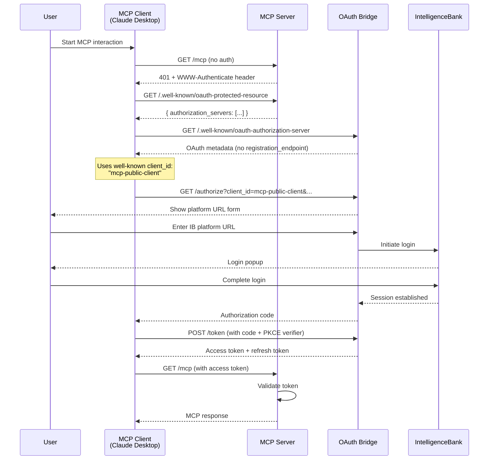

# MCP Integration Guide

## Overview

This guide explains how to integrate your MCP (Model Context Protocol) server with the IntelligenceBank OAuth 2.0 Bridge using zero-configuration authentication.

The IntelligenceBank OAuth Bridge uses a **well-known client configuration** approach, which means MCP clients can authenticate without manual `client_id` configuration. This follows the MCP specification guidance for authorization servers that don't support Dynamic Client Registration.

## Environment Stages

The OAuth Bridge has two stages:

- **Dev Stage** (`/dev`) - Points to dev alias (always $LATEST)
  - URL: `https://66qz7xd2w8.execute-api.us-west-1.amazonaws.com/dev`
  - Use for: Development and testing
  - Updates: Automatic with each deployment

- **Main Stage** (`/main`) - Points to main alias (published versions)
  - URL: `https://66qz7xd2w8.execute-api.us-west-1.amazonaws.com/main`
  - Use for: Production
  - Updates: Manual promotion after testing

**Note:** This guide uses `/dev` URLs for examples. For production, replace `/dev` with `/main`.

## Quick Start

### For MCP Server Developers

Your MCP server needs to implement OAuth 2.0 Protected Resource Metadata ([RFC 9728](https://datatracker.ietf.org/doc/html/rfc9728)) to advertise the authorization server location.

**That's it!** MCP clients will automatically:
1. Discover your OAuth configuration
2. Use the well-known `client_id: "mcp-public-client"`
3. Complete the OAuth flow with PKCE

### For MCP Client Users (Claude Desktop, etc.)

Simply configure your MCP server URL - no manual OAuth configuration needed:

```json
{
  "mcpServers": {
    "ib-tools": {
      "url": "https://mcp.connectingib.com/mcp"
    }
  }
}
```

## Implementation Steps

### Step 1: Implement Protected Resource Metadata Endpoint

Add this endpoint to your MCP server:

**Endpoint:** `GET /.well-known/oauth-protected-resource`

**Response:**
```json
{
  "resource": "https://mcp.connectingib.com/mcp",
  "authorization_servers": [
    "https://66qz7xd2w8.execute-api.us-west-1.amazonaws.com/dev"
  ],
  "scopes_supported": ["profile"]
}
```

**Example Implementation (TypeScript):**
```typescript
app.get('/.well-known/oauth-protected-resource', (req, res) => {
  res.json({
    resource: 'https://mcp.connectingib.com/mcp',
    authorization_servers: [
      'https://66qz7xd2w8.execute-api.us-west-1.amazonaws.com/dev'
    ],
    scopes_supported: ['profile']
  });
});
```

### Step 2: Return 401 with WWW-Authenticate Header

When an unauthenticated request is made to your MCP server, return a 401 response with the `WWW-Authenticate` header:

```http
HTTP/1.1 401 Unauthorized
WWW-Authenticate: Bearer resource_metadata="https://mcp.connectingib.com/.well-known/oauth-protected-resource",
                         scope="profile"
Content-Type: application/json

{
  "error": "unauthorized",
  "message": "Authentication required"
}
```

**Example Implementation (TypeScript):**
```typescript
function requireAuth(req, res, next) {
  const authHeader = req.headers.authorization;
  
  if (!authHeader || !authHeader.startsWith('Bearer ')) {
    res.status(401)
      .set('WWW-Authenticate', 
        'Bearer resource_metadata="https://mcp.connectingib.com/.well-known/oauth-protected-resource", scope="profile"')
      .json({
        error: 'unauthorized',
        message: 'Authentication required'
      });
    return;
  }
  
  // Validate token...
  next();
}
```

### Step 3: Validate Access Tokens

Validate the Bearer token from the `Authorization` header:

```typescript
import jwt from 'jsonwebtoken';

function validateAccessToken(token: string) {
  try {
    // Verify JWT signature and expiration
    const decoded = jwt.verify(token, process.env.JWT_PUBLIC_KEY);
    
    // Extract session info
    const { sub, sid, scope } = decoded;
    
    return {
      valid: true,
      userId: sub,
      sessionId: sid,
      scope: scope
    };
  } catch (error) {
    return { valid: false, error: error.message };
  }
}
```

## Well-Known Client Configuration

### Client ID

**Use this client ID:** `mcp-public-client`

This is a pre-configured public client that all MCP integrations should use.

### Allowed Redirect URIs

Your MCP server's callback endpoint must match one of these patterns:

- `https://*.connectingib.com/callback` - Production MCP servers
- `https://mcp.connectingib.com/callback` - Specific MCP endpoint
- `https://claude.ai/api/mcp/auth_callback` - Claude Desktop (official MCP client)
- `https://claude.com/api/mcp/auth_callback` - Claude Desktop (future domain)
- `http://localhost:{port}/callback` - Local development (standard callback)
- `http://127.0.0.1:{port}/callback` - Local development (IP, standard callback)
- `http://localhost:{port}/oauth/callback` - MCP Inspector
- `http://localhost:{port}/oauth/callback/debug` - MCP Inspector (debug mode)
- `http://127.0.0.1:{port}/oauth/callback` - MCP Inspector (IP)
- `http://127.0.0.1:{port}/oauth/callback/debug` - MCP Inspector (IP, debug mode)

### Requirements

- ✅ **PKCE Required**: Must use PKCE with S256 method
- ✅ **Public Client**: No `client_secret` required
- ✅ **Grant Types**: `authorization_code`, `refresh_token`
- ✅ **Response Type**: `code`

## OAuth Flow

### Complete Flow Diagram



### Step-by-Step Flow

1. **Discovery Phase**
   - MCP client attempts to access your server
   - Server returns 401 with `WWW-Authenticate` header
   - Client discovers OAuth server via `/.well-known/oauth-protected-resource`
   - Client fetches OAuth metadata from bridge

2. **Authorization Phase**
   - Client uses `client_id: "mcp-public-client"`
   - Client generates PKCE challenge (S256)
   - Client redirects user to `/authorize` endpoint
   - User enters IntelligenceBank platform URL
   - User completes login in popup
   - Bridge returns authorization code

3. **Token Exchange Phase**
   - Client exchanges code for tokens at `/token` endpoint
   - Client provides PKCE verifier for validation
   - Bridge returns access token and refresh token

4. **API Access Phase**
   - Client includes access token in `Authorization: Bearer {token}` header
   - Your MCP server validates the token
   - Server returns MCP response

## Token Management

### Access Token Structure

```json
{
  "sub": "user-session-id",
  "sid": "ib-session-id",
  "scope": "profile",
  "sidExp": 1234567890,
  "iat": 1234567890,
  "exp": 1234567890
}
```

### Token Validation

```typescript
function validateToken(req, res, next) {
  const authHeader = req.headers.authorization;
  
  if (!authHeader?.startsWith('Bearer ')) {
    return res.status(401).json({ error: 'Missing or invalid authorization header' });
  }
  
  const token = authHeader.substring(7);
  
  try {
    const decoded = jwt.verify(token, process.env.JWT_PUBLIC_KEY);
    
    // Check token expiration
    if (decoded.exp < Date.now() / 1000) {
      return res.status(401).json({ error: 'Token expired' });
    }
    
    // Attach user info to request
    req.user = {
      sessionId: decoded.sid,
      userId: decoded.sub,
      scope: decoded.scope
    };
    
    next();
  } catch (error) {
    return res.status(401).json({ error: 'Invalid token' });
  }
}
```

### Token Refresh

When the access token expires, MCP clients will automatically use the refresh token:

```http
POST /token HTTP/1.1
Host: 66qz7xd2w8.execute-api.us-west-1.amazonaws.com
Content-Type: application/x-www-form-urlencoded

grant_type=refresh_token
&refresh_token={refresh_token}
&client_id=mcp-public-client
```

## Configuration Examples

### Development Environment

```json
{
  "mcpServers": {
    "ib-tools-dev": {
      "url": "http://localhost:3000/mcp",
      "env": {
        "OAUTH_BRIDGE": "https://66qz7xd2w8.execute-api.us-west-1.amazonaws.com/dev"
      }
    }
  }
}
```

### Production Environment

```json
{
  "mcpServers": {
    "ib-tools": {
      "url": "https://mcp.connectingib.com/mcp"
    }
  }
}
```

## Testing Your Integration

### 1. Test Protected Resource Metadata

```bash
curl https://mcp.connectingib.com/.well-known/oauth-protected-resource
```

Expected response:
```json
{
  "resource": "https://mcp.connectingib.com/mcp",
  "authorization_servers": [
    "https://66qz7xd2w8.execute-api.us-west-1.amazonaws.com/dev"
  ],
  "scopes_supported": ["profile"]
}
```

### 2. Test 401 Response

```bash
curl -i https://mcp.connectingib.com/mcp
```

Expected response:
```http
HTTP/1.1 401 Unauthorized
WWW-Authenticate: Bearer resource_metadata="https://mcp.connectingib.com/.well-known/oauth-protected-resource", scope="profile"
```

### 3. Test OAuth Discovery

```bash
curl https://66qz7xd2w8.execute-api.us-west-1.amazonaws.com/dev/.well-known/oauth-authorization-server
```

Expected response includes:
```json
{
  "issuer": "https://66qz7xd2w8.execute-api.us-west-1.amazonaws.com/dev",
  "authorization_endpoint": "...",
  "token_endpoint": "...",
  "code_challenge_methods_supported": ["S256"]
}
```

### 4. Test Complete OAuth Flow

Use the MCP Inspector or Claude Desktop to test the complete flow:

1. Configure your MCP server URL
2. Attempt to access the server
3. Complete OAuth login when prompted
4. Verify MCP operations work with the obtained token

## Troubleshooting

### Common Issues

#### 1. "Unknown client_id" Error

**Problem:** Client is not using the well-known client ID.

**Solution:** Ensure your MCP client is using `client_id: "mcp-public-client"`

#### 2. "redirect_uri does not match allowed patterns"

**Problem:** Your callback URL doesn't match the allowed patterns.

**Solution:** Ensure your callback URL matches one of:
- `https://*.connectingib.com/callback`
- `http://localhost:{port}/callback` (standard MCP tools)
- `http://localhost:{port}/oauth/callback` (MCP Inspector)
- `http://localhost:{port}/oauth/callback/debug` (MCP Inspector debug mode)

#### 3. "code_challenge is required"

**Problem:** PKCE is not being used.

**Solution:** Ensure your MCP client implements PKCE with S256 method.

#### 4. "Invalid token" Error

**Problem:** Token validation is failing.

**Solution:** 
- Verify you're using the correct JWT public key
- Check token hasn't expired
- Ensure token format is correct

### Debug Mode

Enable debug logging in your MCP server:

```typescript
app.use((req, res, next) => {
  console.log('MCP Request:', {
    method: req.method,
    path: req.path,
    headers: req.headers,
    hasAuth: !!req.headers.authorization
  });
  next();
});
```

## Security Considerations

### PKCE Enforcement

The OAuth bridge **requires** PKCE (Proof Key for Code Exchange) for all public clients:

- ✅ Code challenge method: `S256` (SHA-256)
- ✅ Code verifier: 43-128 characters, `[A-Za-z0-9-._~]+`
- ✅ Code challenge: Base64-URL encoded SHA-256 hash

### Token Security

- ✅ Access tokens expire after 1 hour
- ✅ Refresh tokens can be used to obtain new access tokens
- ✅ Tokens are bound to the PKCE verifier
- ✅ All tokens are JWT-signed

### Redirect URI Validation

- ✅ Pattern-based validation (no wildcards)
- ✅ HTTPS required for production
- ✅ Localhost allowed for development

## API Reference

### OAuth Bridge Endpoints

#### Authorization Endpoint
```
GET https://66qz7xd2w8.execute-api.us-west-1.amazonaws.com/dev/authorize
```

**Parameters:**
- `client_id`: `mcp-public-client` (required)
- `redirect_uri`: Your callback URL (required)
- `response_type`: `code` (required)
- `scope`: `profile` (required)
- `state`: Random string for CSRF protection (recommended)
- `code_challenge`: PKCE challenge (required)
- `code_challenge_method`: `S256` (required)

#### Token Endpoint
```
POST https://66qz7xd2w8.execute-api.us-west-1.amazonaws.com/dev/token
```

**Parameters (form-urlencoded):**
- `grant_type`: `authorization_code` or `refresh_token` (required)
- `code`: Authorization code (required for authorization_code)
- `redirect_uri`: Must match authorization request (required for authorization_code)
- `client_id`: `mcp-public-client` (required)
- `code_verifier`: PKCE verifier (required for authorization_code)
- `refresh_token`: Refresh token (required for refresh_token)

#### Metadata Endpoint
```
GET https://66qz7xd2w8.execute-api.us-west-1.amazonaws.com/dev/.well-known/oauth-authorization-server
```

Returns OAuth 2.0 Authorization Server Metadata per RFC 8414.

## Additional Resources

### Specifications
- [MCP Authorization Specification](https://spec.modelcontextprotocol.io/specification/architecture/authorization/)
- [RFC 8414 - OAuth 2.0 Authorization Server Metadata](https://datatracker.ietf.org/doc/html/rfc8414)
- [RFC 9728 - OAuth 2.0 Protected Resource Metadata](https://datatracker.ietf.org/doc/html/rfc9728)
- [RFC 7636 - PKCE](https://datatracker.ietf.org/doc/html/rfc7636)
- [OAuth 2.1 Draft](https://datatracker.ietf.org/doc/html/draft-ietf-oauth-v2-1-13)

### IntelligenceBank Documentation
- [API Documentation](./api-documentation.md)
- [Client Integration Guide](./client-integration.md)
- [Architecture Overview](./architecture.md)

## Support

For issues or questions:
1. Check the [Troubleshooting](#troubleshooting) section
2. Review the [API Documentation](./api-documentation.md)
3. Contact the IntelligenceBank support team

## Changelog

### 2025-01-29
- **OAuth Discovery Resolution**: Added Claude Desktop callback URLs
  - `https://claude.ai/api/mcp/auth_callback` (current)
  - `https://claude.com/api/mcp/auth_callback` (future-proofing)
- Resolves "redirect_uri does not match allowed patterns" error with Claude Desktop
- Implementation verified to be 100% compliant with MCP Authorization specification

### 2025-01-28
- Added MCP Inspector redirect URI patterns for testing
- Support for both `/callback` and `/oauth/callback` redirect patterns
- Support for MCP Inspector debug mode (`/oauth/callback/debug`)

### 2025-01-27
- Initial release with well-known client configuration
- Support for MCP OAuth integration
- PKCE enforcement for public clients
- Pattern-based redirect URI validation